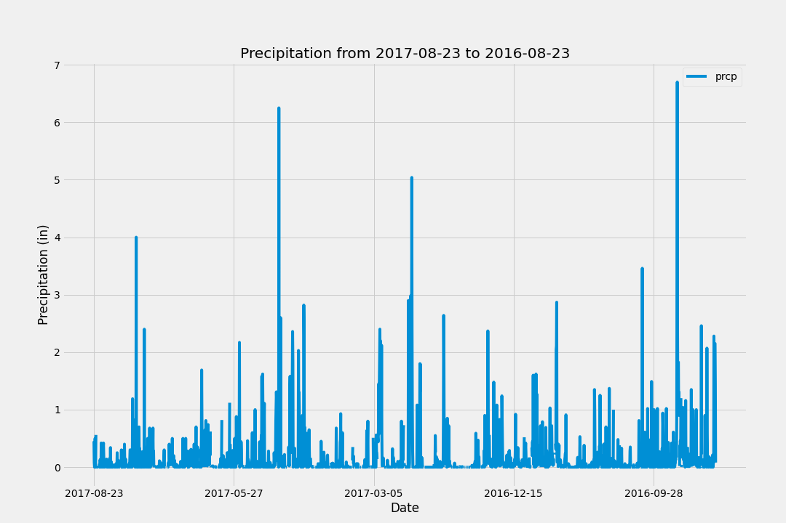
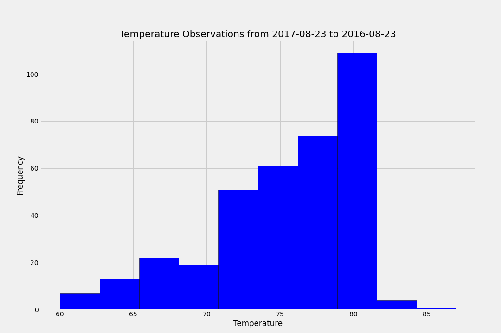

# sqlalchemy-challenge
Climate analysis on Honolulu, Hawaii to planning a vacation trip from 2017-04-11 to 2017-04-25.

**Objetive:** use Python and SQLAlchemy to do basic climate analysis and data exploration of your climate database. Using:
  - SQLAlchemy ORM
  - Pandas
  - Matplotlib
  - Flask API

## Step 1 - Climate Analysis and Exploration

### Precipitation Analysis

  - Use SQLAlchemy ORM to retrieve the last 12 months of precipitation data.
  - Select only the date and precipitation values.
  - Sort the DataFrame values by date.
  - Plot the results using the DataFrame plot method.
  - Use Pandas to print the summary statistics for the precipitation data.

### Station Analysis

  - Design a query to calculate the total number of stations.
  - Design a query to find the most active stations.
  - Design a query to retrieve the last 12 months of temperature observation data (TOBS).
  - Plot the results as a histogram.

## Step 2 - Climate App
Design a Flask API based on the queries below.

   - `/` Homepage route: listing all available routes.

   - `/api/v1.0/precipitation` route: returning a JSON representation of a dictionary of dates and precipitations for all stations.
 
   - `/api/v1.0/stations` route: returning a JSON list of stations.

   - `/api/v1.0/tobs` route: returning a JSON list of temperature observations of the most active station for the last year of data.

   - `/api/v1.0/<start>` route: returning a JSON list of the minimum temperature, the average temperature, and the max temperature for a given start. User can select the start date.

   - `/api/v1.0/<start>/<end>` route: returning a JSON list of the minimum temperature, the average temperature, and the max temperature for a given start. User can select the start and end date.
