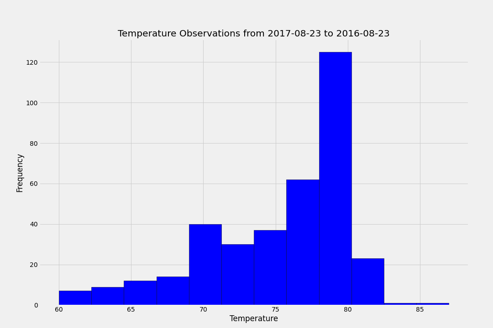

# sqlalchemy-challenge
Climate analysis on Honolulu, Hawaii to planning a vacation trip from 2017-04-11 to 2017-04-25.

**Objetive:** use Python and SQLAlchemy to do basic climate analysis and data exploration of your climate database. Using:
  - SQLAlchemy ORM
  - Pandas
  - Matplotlib
  - Flask API

### Step 1 - Climate Analysis and Exploration

  - Use SQLAlchemy ORM to retrieve the last 12 months of precipitation data.
  - Select only the date and precipitation values.
  - Sort the DataFrame values by date.
  - Plot the results using the DataFrame plot method.
  - Use Pandas to print the summary statistics for the precipitation data.

### Step 2 - Climate Analysis and Exploration

  - Design a query to calculate the total number of stations.
  - Design a query to find the most active stations.
  - Design a query to retrieve the last 12 months of temperature observation data (TOBS).
  - Plot the results as a histogram

